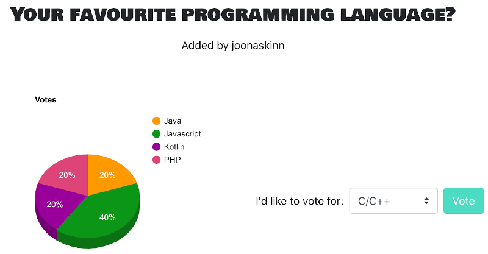

## Voting App
Full Stack ReactJS + Node + MongoDB app.

An application where users can create a poll with any number of possible items and vote on other users polls.

Working demo: [https://voting-app-jk.herokuapp.com/](https://voting-app-jk.herokuapp.com/)

